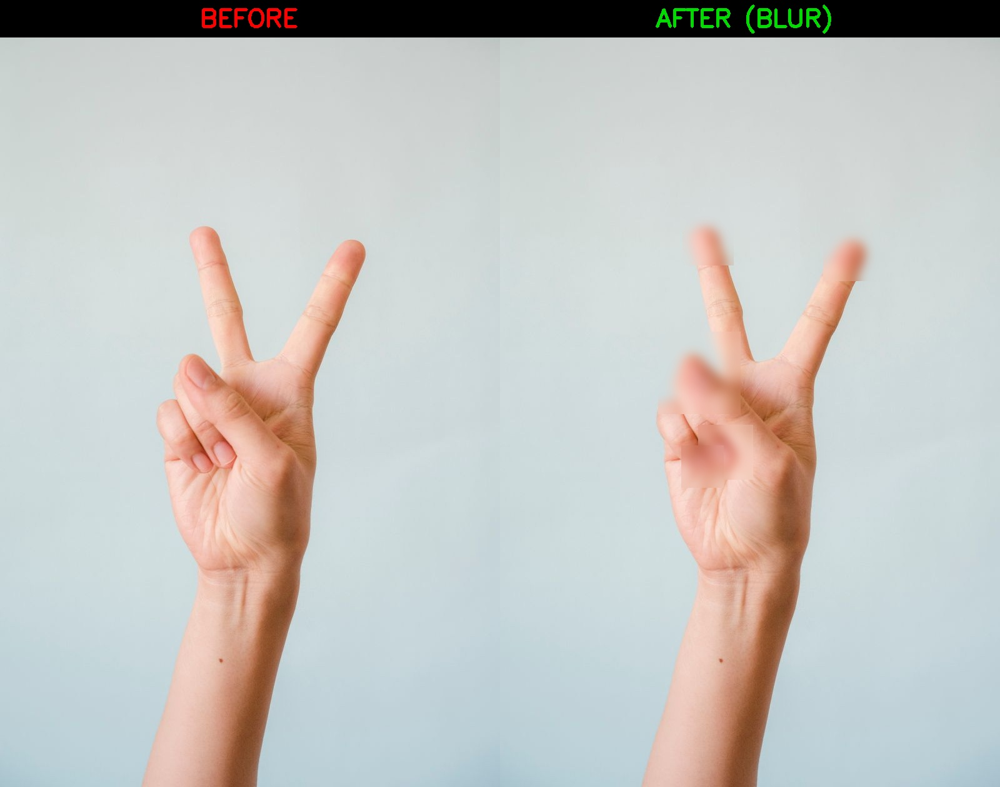
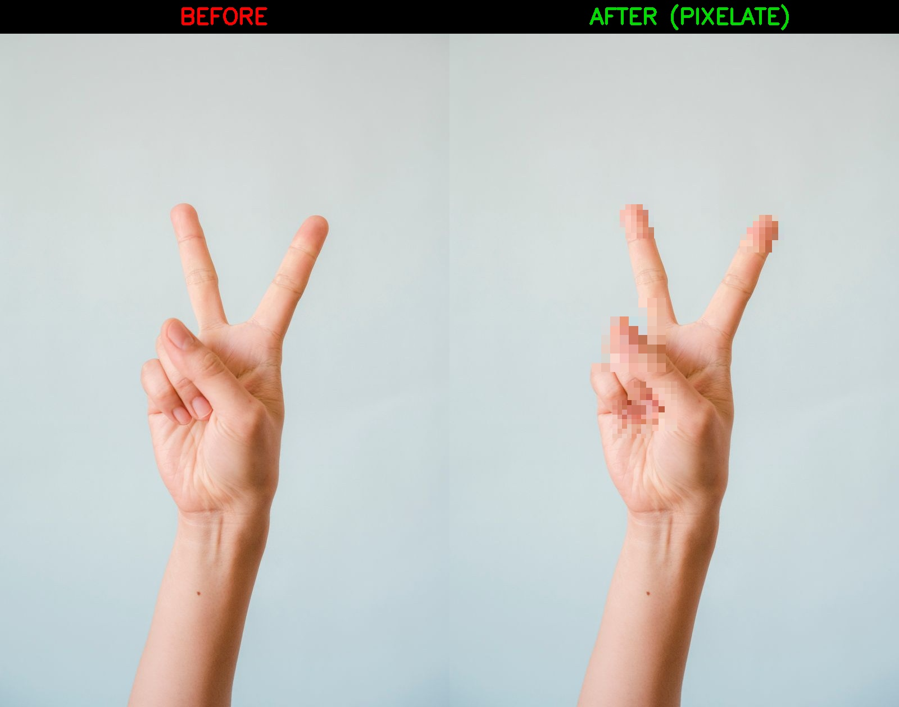
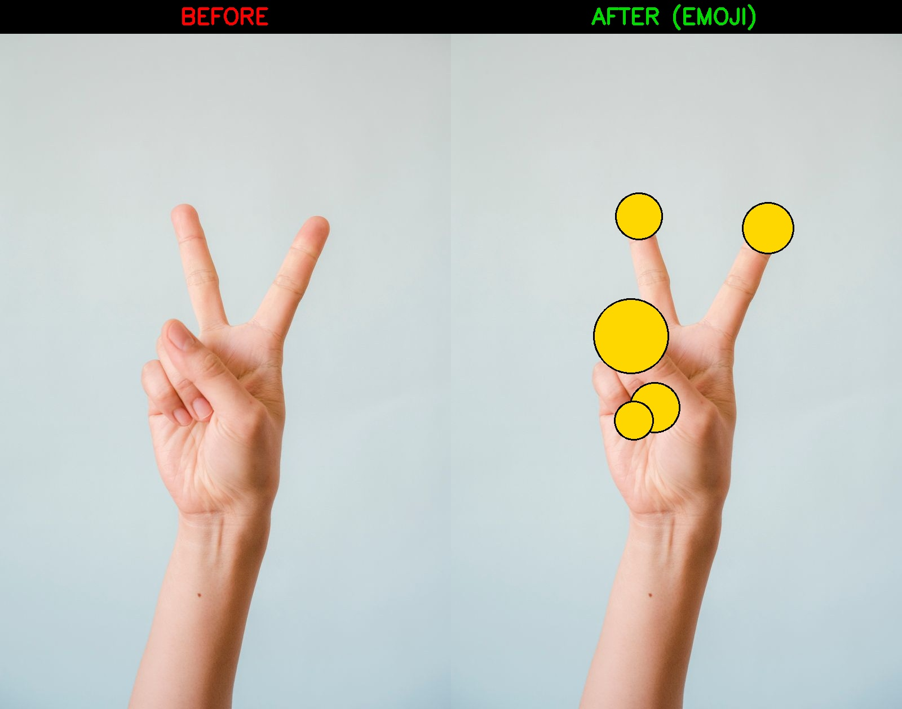
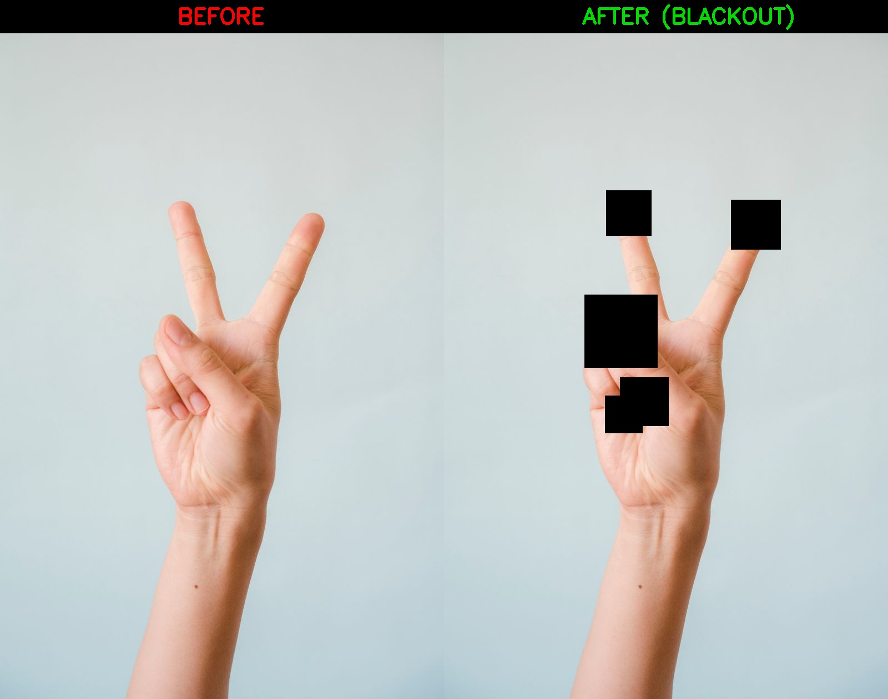

# 🛡️ FingerLeak

> **Detect, score, and mitigate fingerprint leakage from everyday photos and videos.**

A research-backed pipeline that locates fingertip regions in images, estimates the **fingerprint-extraction risk**, and applies privacy filters (blur / pixelate / emoji / blackout) before the image ever leaves your device.


---

## ✨ Why FingerLeak?

Modern phone cameras can capture **enough fingerprint detail from a casual selfie** to allow biometric spoofing. FingerLeak is an open-source toolkit that:

1. 🔎 **Detects** hands & fingertips with MediaPipe.
2. 📊 **Scores** the extraction risk (`FingerLeak-Score`) based on resolution, sharpness, lighting, and finger area.
3. 🛡️ **Mitigates** the risk by selectively obfuscating only the fingertip regions — preserving the rest of the photo.

---

## 🖼️ Privacy Filter Showcase

Same input image processed with four different privacy filters. Notice how only the **fingertips** are altered while the hand pose and identity remain intact.

### 🔵 Blur (Gaussian)


### 🟪 Pixelate


### 🟡 Emoji disc


### ⬛ Blackout


---

## 🚀 Quick Start

```bash
# 1. Clone and set up
git clone https://github.com/Amara-ch/fingerleak.git
cd fingerleak
python -m venv .venv
.\.venv\Scripts\Activate.ps1     # Windows
# source .venv/bin/activate      # Linux/Mac
pip install -r requirements.txt

# 2. Run privacy demo on the sample image
python scripts/demo_privacy.py --mode pixelate

# 3. Open the result
start outputs/privacy_demo.jpg   # Windows
```

---

## 🧪 Tests

```bash
pytest -v
```

Current coverage:
- ✅ Risk-score module
- ✅ Fingertip cropping
- ✅ Privacy filters (blur / pixelate / blackout / emoji)

---

## 📂 Project Structure

```
fingerleak/
├── src/fingerleak/
│   ├── detection/          # MediaPipe hand + fingertip cropping
│   ├── scoring/            # FingerLeak-Score risk metric
│   └── privacy/            # Blur / pixelate / emoji / blackout filters
├── scripts/
│   └── demo_privacy.py     # End-to-end before/after demo
├── tests/                  # Pytest suite
├── data/samples/           # Example hand image
└── outputs/                # Generated demo images
```

---

## 🛣️ Roadmap

- [x] Hand & fingertip detection (MediaPipe)
- [x] FingerLeak-Score metric
- [x] Privacy filter module (4 modes)
- [x] Before/after demo pipeline
- [ ] Real-time webcam demo
- [ ] Streamlit web UI
- [ ] Mobile (Android) port

---

## 📜 License

MIT © 2026 — see [LICENSE](LICENSE).

---

## 🙏 Acknowledgements

- [MediaPipe Hands](https://developers.google.com/mediapipe/solutions/vision/hand_landmarker)
- Research inspiration: NII Japan fingerprint-from-photo studies
